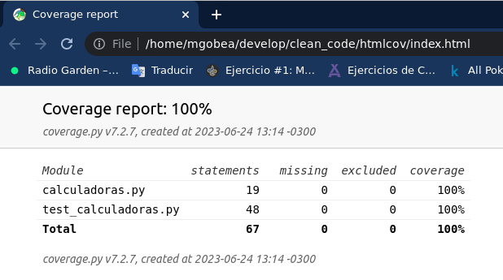

# Principios de Clean Code o buenas prácticas en coding

## Nombres significativos

### ¿Que nombramos al programar?

1. Variables, funciones y argumentos
2. Clases, paquetes.
3. Ficheros y directorios.
4. Ficheros de despliegue

### Principios para nombrar: 

1. Los nombres deben revelar intención.
2. Evitar la desinformación. Ej: no llamar lista a algo que en realidad es un map o una tupla, clases con nombres largos y muy parecidos pero con diferencias en el centro
3. Usá nombres pronunciables. Los nombres deben ser fáciles de buscar. Es mucho mejor elegir un nombre muy largo a uno que no deja claro su significado. 
4. Añade contexto que aporte significado. Ejemplos: variables firstName, lastName, street, houseNumber, city, state y zipcode hacen sentido estando juntas, pero si las vemos separadas dificilmente sepamos a que hacen referencia. Entonces podríamos agregarle por ejemplo el prefijo **addr** a los atributos para darles contexto. Ej: addr_first_name

### Nombres de las clases

1. Los nombres de las clases deben ser un nombre o conjunto de nombres, no deberían ser verbos
2. Los nombres de los métodos deberían ser verbos, indicando una acción
3. No llamar a una clase CreateEmployee ni a un método EmployeeName(), debería ser Employee el nombre de la clase y get_employee_name el nombre de su método. 

----------------------------------------------------------

## Caracteristicas de las buenas funciones

1. Son pequeñas. De ser posible... muy pequeñas
2. Hacen **UNA** sola cosa.
3. Nivel de abstracción único. Ejemplo de la clase Person que mezcla metodos propios de la clase coche con los que si le corresponden
4. Reciben pocos argumentos. Se deben evitar las funciones con mas de 3 argumentos. Un gran numero de argumentos suele indicar una mala encapsulación. Ejemplo una función "create_user" que recibe 5 argumentos: username, password, firstname, lastname y address podría recibir **solo 1 argumento** (user_form_data: UserFormData) si encapsulamos los 5 atributos anteriores en una clase antes de enviarlos a la función. 
5. No tienen efectos secundarios.
6. Devuelven excepciones en lugar de codigos de error. Es una buena práctica que nuestras funciones devuelvan excepciones programadas en lugar de "logs" informando un error en caso de que algo falle. Dado que de devolver excepciones podríamos manejar el resultado de las mismas con bloque try - catch ó try - except (para los pythonicos como yo)

----------------------------------------------------------

## Comentarios

1. El código limpio o buen código se debe leer perfectamente, sin ningún comentario o casi ningún comentario (Regla de oro del Clean Code)
2. Añadir comentarios solo cuando sea estrictamente necesario. 
3. Son muy complicados de mantener. El código cambia muy rápido, y los comentarios quedan desactualizados rápidamente. 
4. Si el digo tiene muchos comentarios, puede ser dos razones:
   1. El codigo no se entiende --> Refactorización.
   2. Los comentarios son obvios --> Eliminar comentarios. 
5. Nunca dejes comentado código que ya no se está utilizando. ¡Para algo tenemos el software de control de versiones como Git!

### Casos de buenos comentarios

1. Comentar las expresiones regulares con ejemplos del formato permitido por un REGEX.
2. Los Javadocs, docstrings en Python o la documentación inteligente y dinámica de frameworks como FastApi de Python son otro ejemplo claro de buenos y **útiles** comentarios. 
3. Comentarios para marcar TODO´s. Pero no cualquier TODO sino aquel TODO sobre el cual necesitamos el avance de otro equipo para poder avanzar con el mismo (dependencias)

--------------------------------------------------------

## Formato del código

1. Un buen formato facilita la lectura del código. 
2. Recomenadaciones:
   1. Configurar el IDE para que aplique el formato automáticamente al guardar los cambios
   2. Todo el equipo de trabajo debe escribir bajo las mismas reglas
   3. Seguir el styleguide de Google que está disponible para varios lenguajes. Por ejemplo en Java está en: https://google.github.io/styleguide/javaguide.html


### Formato Vertical - Densidad

Es el numero de lineas que hay en un bloque de código en concreto. 

Por ejemplo a la hora de definir una clase nos conviene dejar espacios en blanco entre el primer método y los atributos así como entre método y método para reducir la densidad del código. 

### Formato Vertical - Orden

Ejemplo, si tenemos una función c, una b y un a que llama a la b y c dentro es preferible declarar primero la función a con la llamada a b y c y debajo de a las funciones b y c en ese orden. Al reves no se vería de forma limpia. 

### Formato Verticual - Distancia

Agrupar conceptos relacionados y separar conceptos diferentes. Por ejemplo, dentro de una función podemos dejar juntos, sin espacios las distintas variables que vamos a usar, luego de ellas un if, un nuevo espacio y el return. 

## Formato Horizontal - Densidad

Consiste que no dejar el código muy compacto para facilitar la lectura. Por ejemplo dejar lugares en blanco entre los signos y las letras y/o numeros contribuye a una densidad horizontal equilibrada. 

## Formato Horizontal - Indentación

La identación es clave pero con Python ese problema no lo tendremos nunca dado que la identación estructura los bloques de codigo sin necesidad de usar llaves como en otros lenguajes (java, javascript, etc)

---------------------------------------------------

## Gestión de errores

1. El codigo debe ser limpio, pero también robusto.
2. La gestión de errores puede ensuciar mucho el código, por lo que hay que prestarle especial atención. 
3. Devolver excepciones en lugar de códigos de error
4. Usar excepciones unchecked
5. No devoler ni pasar null. Si pasamos null quien lo recibe está obligado a verificar que hayamos devuelto algo distinto de null para continuar. Caso contrarío podriamos generar una NullPointerExcepction que podría generar errores en el código por no tratarlo correctamente. 

### ¿Que son las **unchecked exceptions**?

1. Se trata de excepciones que heredan de la clase RuntimeExcepción. Es decir, son excepciones que ocurren en tiempo de ejecución y no en tiempo de compilación. Ejemplo: la NullPointerException de Java
2. Se pueden tratar con try-catch (o try-except en Python) pero no es estrictamente necesario. 
3. Las excepciones checked, son las excepciones normales, heradan de Excepción. **Si no las tratas el programa no compila.**
4. Recomendado **usar checked Excepctions si se trata de una librería crítica**, que sea de obligado cumplimiento tratar las excepciones. 

-----------------------------------------------------

## Test Unitarios

### Tener test que pueben tus funciones y clases es fundamental para:

1. La refactorización del código. 
2. Estar seguros a la hora de realizar modificaciones sobre el código. Si tenemos un alto coverage de Testing (>90%) esto nos ofrece mucha seguridad a la hora de iterar el codigo. Lo modificamos y si sigue pasando los test unitarios entonces es correcto el codigo que implementamos. 

Para hacer testing se recomienda usar las librerías que casi todos los lenguajes de programación tienen con este objetivo. Algunas de las mas conocidas son: JUnit, unittest, jasmine, etc. 

**Test Driver Development (TDD):** Filosofía de desarrollo de Software muy conocida orientada integralmente al desarrollo de Test Unitarios. Desarrollo guiado por test. 
Antes de crear codigo para una nueva funcionalidad, **lo primero que debo escribir es el test de esa funcionalidad.**, En segundo lugar **implementamos la funcionalidad que queriamos desarrollar** desde el inicio teniendo en consideración que debe pasar el test que ya fue escrito. En tercer lugar, mejorar el código que acabamos de desarrollar, **limpiando el codigo, refactorizando, etc, estando seguros de que no vamos a romper** nada dado que en la medida en que generamos cambios vamos testeando los mismos.  

Esta filosofía es muy buena en la teoria pero en la práctica es muy complicada de implementar por lo que muy poca gente lo sigue al 100%. Al implementar primero los tests, tu código será mas facil de probar. 

-------------------------------------------------------

## Ejemplo practico: 

Para llamar a los métodos de nuestras clases de test podemos usar la estructura: 

- given(pre-condición/dado) + when(cuando) + then(entonces): 

- Clases a testear: 

```py
class CalculadoraEstatica:
    # Puedo acceder a sus métodos sin instanciarla
    @staticmethod
    def suma(a, b):
        return a + b

    @staticmethod
    def resta(a, b):
        return a - b

    @staticmethod
    def division(a, b):
        return a / b
    

class Calculadora:
    # Tiene constructor dado que para acceder a sus métodos debo instanciarla
    def __init__(self):
        pass

    def suma(self, a, b):
        return a + b

    def resta(self, a, b):
        return a - b

    def division(self, a, b):
        return a / b
```

- Clases de testeo con unittest y coverage para ver y analizar cobertura: 


```py
from unittest import TestCase
from calculadoras import CalculadoraEstatica, Calculadora


class CalculadoraEstaticaTest(TestCase):

    def test_metodo_suma_deberia_retornar_la_suma_de_dos_numeros(self):
        # Given
        numero1 = 5
        numero2 = 10

        # When
        resultado = CalculadoraEstatica.suma(numero1, numero2)

        # Then
        self.assertEqual(resultado, 15)

    def test_metodo_resta_deberia_retornar_la_resta_de_dos_numeros(self):
        # Given
        numero1 = 10
        numero2 = 5

        # When
        resultado = CalculadoraEstatica.resta(numero1, numero2)

        # Then
        self.assertEqual(resultado, 5)

    def test_metodo_division_deberia_retornar_el_cociente_de_dos_numeros(self):
        # Given
        numero1 = 10
        numero2 = 2

        # When
        resultado = CalculadoraEstatica.division(numero1, numero2)

        # Then
        self.assertEqual(resultado, 5)
    
    def test_metodo_division_deberia_generar_un_error_si_el_divisor_es_cero(self):
        # Given
        numero1 = 10
        numero2 = 0

        # When & Then
        with self.assertRaises(ZeroDivisionError):
            CalculadoraEstatica.division(numero1, numero2)


class CalculadoraTest(TestCase):

    def test_metodo_suma_deberia_retornar_la_suma_de_dos_numeros(self):
        # Given
        mi_clase = Calculadora()
        numero1 = 5
        numero2 = 10

        # When
        resultado = mi_clase.suma(numero1, numero2)

        # Then
        self.assertEqual(resultado, 15)

    def test_metodo_resta_deberia_retornar_la_resta_de_dos_numeros(self):
        # Given
        mi_clase = Calculadora()
        numero1 = 10
        numero2 = 5

        # When
        resultado = mi_clase.resta(numero1, numero2)

        # Then
        self.assertEqual(resultado, 5)

    def test_metodo_division_deberia_retornar_el_cociente_de_dos_numeros(self):
        # Given
        mi_clase = Calculadora()
        numero1 = 10
        numero2 = 2

        # When
        resultado = mi_clase.division(numero1, numero2)

        # Then
        self.assertEqual(resultado, 5)
    
    def test_metodo_division_deberia_generar_un_error_si_el_divisor_es_cero(self):
        # Given
        mi_clase = Calculadora()
        numero1 = 10
        numero2 = 0

        # When & Then
        with self.assertRaises(ZeroDivisionError):
            mi_clase.division(numero1, numero2)
```

Para simplemente ejecutar los testeos usando unittest debo ubicarme en el directorio donde tengo el archivo de testing y ejecutar el comando: 

```bash
python3 -m unittest nombre_del_archivo.py
```

Si quiero ejecutar los tests usando el modulo de coverage entonces debo: 

1. Instalar coverage en mi venv: 

```bash
pip install coverage
```

2. Asegurarme de que mi archivo de test comience con "test_" y termine con ".py"

3. Ejecutar en consola: 

```bash
coverage run -m unittest discover
```
Ejecuta todos los test que tenga la sintaxis señalada arriba

```bash
coverage report
```
Imprime por consola el reporte de cobertura

```bash
13:13:59 👽 with 🤖 mgobea 🐶 in ~/develop/clean_code via clean_code …
➜ coverage report
Name                   Stmts   Miss  Cover
------------------------------------------
calculadoras.py           19      0   100%
test_calculadoras.py      48      0   100%
------------------------------------------
TOTAL                     67      0   100%
```

```bash
coverage html
```
Genera un directorio y dentro del mismo un archivo index.html donde podremos ver en una web el mismo reporte de cobertura que antes veiamos por consola. 



----------------------------

## Code Smells (Código que huele mal)

**¿Que son los code smells?**

1. Son síntomas de que el código no es todo lo limpio que debería. Algo "huele mal en el código".
2. 7 Tipos de code smells:
   1. En los comentarios
   2. En el entorno de desarrollo
   3. En las funciones
   4. Code smells generales
   5. Code smells en Java (aunque muchos se peuden aplicar a otros lenguajes)
   6. En los nombres
   7. En los tests.

------------------------------

## Code smell en los comentarios: 

**C1: Información inapropiada**

Todo lo que esté mejor en otro sistema (ej. Sistema de control de cambios - Git) debe ser eliminado del codigo. 

Ejemplo mas clasico ó 1: Código sin uso en la actualidad que lo dejamos "por las dudas". Es una mala práctica dado que si llegamos a necesitarlo podemos volver a encontrarlo en la historia de nuestro proyecto de Git u otro sistema de versionado. 

Ejemplo 2: Dejar comentado los datos del autor del código y la fecha de creación... Esto es información que ya queda registrada en nuestro sistema de versionado.

```py
# @author Mariano Gobea
# Create Date: 24.06.2023 13:45 hs
class Comments:
   pass
```

Ejemplo 3: TODO´s con los pendientes. También es una mala práctica. Los pendientes deben ser registrados en un sistema de registro de tareas pendientes como por ejemplo "Monday" o "Notion" no en el código en sí. 

Ejemplo 4: Comentarios obsoletos, supongamos que tenemos una una variable que almacena una fecha y en principio era de tipo string pero luego la cambiamos a Datetime. Si el comentario sigue señalando que es de tipo String entonces se trata de un comentario obsoleto: 

```java
private Date lastLoginDate; // Last Login date as String (DD-MM-YYYY HH:MM)
```
Ejemplo 5: Comentarios redundantes. Es decir, comentarios que dan información que es muy clara con solo leer el código si es que el mismo fue bien nombrado. 

Ejemplo 6: Comentarios mal redactados. No hay que cometer faltas de ortografía en los comentarios, debemos asegurarnos de que se entienda lo que queremos decir con los mismos.

-------------------------

## Code smells asociados al entorno de desarrollo. 

Mas concretamente son code smells asociados a la etapa de compilación del software y de la ejecución de tests. 

**E1: La compilación requiere mas de un paso:**

Debes ser capaz de hecer un checkout del código fuente con un comando y compilarlo con otro. 

Aplicado a Python tiene que ver con las dependencias de un proyecto. Es importante detallar las mismas (archivo requirements.txt) así como un código simple que nos permita tenerlas y no estar instalando una por una. En python ese comando es: 

```bash
pip install -r requirements.txt
```
Por supuesto que este comando solo va a funcionar en los casos donde contemos en el proyecto donde estamos trabajando con un archivo requirements.txt. De allí la importancia de generarlo y mantenerlo actualizado al mismo cuando somos nosotros los que iniciamos un proyecto o agregamos dependencias al mismo que inicialmente no existian. 

**E2: Los tests requieren mas de un paso**

Los tests se deben ejecutar con único comando que sea simple, rápido y obvio. Caso contrario corremos el riesgo de ejecutar los tests habitualmente por "pereza". Debemos ejecutar los tests cada día decenas, o incluso cientos de veces para evitar cometer errores en el código que luego nos cueste mucho tiempo encontrar. 

Ejemplo en python para ejecutar un archivo de test contamos con el comando: 

```bash
python3 -m unittest nombre_del_archivo.py
```

--------------------------------

## Code smells asociados a las funciones

**F1: Demasiados argumentos**

Lo mejor es que una función no reciba argumentos, seguido por uno, dos y tres argumentos. Se deben evitar las funciones con > 3 argumentos. 

Es una buena práctica, que ya mencionamos mas arriba encapsular argumentos dentro de una clase cuando la misma recibe mas de 3 argumentos. Otra opción es dividir la función en dos o mas funciones para reducir así la cantidad de argumentos recibidos. Dado que seguramente si una función recibe mas de tres argumentos su scope sea superior a la máxima que reza que una función debe hacer una única cosa. 

**F2: Argumentos de salida**

Una función no debe realizar tareas de salida a consola, por ejemplo, no debe imprimir. En su lugar debe retornar los valores que que queremos sacar de la misma para que la impresión se realice desde el codigo principal.

Otro ejemplo del mismo error es envíar un argumento con puntero (& para enviarla y * para recibirla. Al igual que los punteros en Golang), es decir, del entorno global del programa, dado que queremos modificarlo dentro de la función en lugar de retornar un valor de la función y luego guardarlo en una variable que invoque a nuestra función.

**F3: Pasar flags (variables booleanas) como argumento**

¿Por que es un error? Porque un flag suele indicar que una función hace mas de una cosa, es decir, va a hacer algo si el flag es true y otra cosa si el flag es false. Y como ya repetimos muchas veces esto es un error dado que una función debe hacer una única cosa. Si tenes la necesidad de hacer dos cosas distintas entonces debemos generar dos funciones distintas en lugar de una función que reciba un booleano. 

**F4: Funciones Muertas**

Son aquellas funciones que no se llaman nunca. Las mismas se deben eliminar. Si las necesitamos en el futuro siempre podemos ir a buscarlas a GIT. 

--------------------------------

## Code smells generales - Parte 1: 

**G1: Múltiples lenguajes en un mismo archivo:**

No debemos mezclar dos lenguajes en un mismo fichero. Ej: Java + HTML o JS + CSS, etc.

**G2: Comportamiento obvio no implementado**

Por ejemplo si tenemos un método que convierte un string con el nombre de un mes a un enum del mismo mes ("July" a Month.JULY) vamos a esperar que haga lo mismo si escribo "July" de otras formas tales como "JULY" o "july". Sie el codigo efectivamente no hace eso entonces perdemos la confianza en el mismo y se debe revisar lo que el mismo hace linea por linea.

**G3: Comportamiento incorrecto en los límites del codigo**

Ejemplo, un codigo que en función de la pertenencia a dos listas (meses de 30 y meses de 31 días) clasifica un string con un nombre de un mes entre mes de 31, mes de 30 o mes de 28 falla en los límites dado que si el año es bisiesto febrero tendrá 29 en lugar de 28. 

**G4: Anular mecanismos de seguridad**

1. Deshabilitar warnings del compilador
2. Comentar o ingnorar tests que están fallando
3. Ignorar los reportes de plataformas de análisis de código (SonarQube)

**G5: Duplicidad**

1. La duplicidad en el código representa una oportunidad perdida para crear una nueva abstracción. 
2. El código repetido se puede abstraer en un método o incluso una clase. 
3. La duplicidad en varias clases puede indicar la necesidad de una jerarquía y aplicar herencia entre nuestras clases. 

**G6: Código en el nivel de abstracción incorrecto**

Ejemplos: clase "conductor" que tiene entre sus métodos encender el motor y apagar el motor, cuando los mismos deberían ser métodos de otra clase llamada "auto". Otro ejemplo puede ser una clase Vehiculo que tiene entre sus metodos "cambiar canal de radio" este mismo debería ser un método de la clase "radio". ¿Por que es ajeno? Porque no necesariamente todos los vehiculos tienen Radio (una moto en general no tiene) entonces poner ese método en esta clase es un error de abstracción. 

**G7: Clases base dependen de las clases derivadas**

Las clases base no deben saber nada de las derivdas sino que debe funcionar a la inversa.

**G8: Demasiada información**

1. Los módulos bien definidos tienen interfaces muy pequeñas que permiten hacer mucho con pocos métodos.
2. Debés codear únicamente lo estrictamente necesario
3. En POO (Programación Orientada a Objetos), esconde tus datos, ofrece operaciones. 

**G9: Código muerto**

1. El código que no se ejecuta se debe eliminar inmediatamente:
   1. Funciones que no se llaman.
   2. Condiciones en swithc/cas o if que no se dan nunca.
   3. try/catch con excepciones que nunca se lanzan (try/except en Python)
2. El software de control de versiones (Git por ejemplo) recondará todo por vos para cuando lo necesites. 

**G10: Distancia vertical**

1. Las variables y funciones deben estar cerca de donde se usan:
   1. Las variables locales se deben declarar justo antes de usarlas
   2. Las funciones privadas deben estar justo debajo de la primera función que las usa
2. No queremos que código local esté situado a cientos de lineas de donde se usa. 

**G11: Inconsistencia**

1. Si haces algo de cierta manera, hazlo siempre de la misma forma.
2. Por ejemplo, si utilizas la palabra Processor en UserRequestProcessor, no crees la clase AdminRequestHandler
3. Si eliges la palabra delete para las eliminaciones, no uses remove
4. La consistencia hace que nuestro código sea mucho mas facil de leer. 

**G12: Basura**

1. Constructores por defecto sin implementación
2. Getters y setters de absolutamente todas las variables privadas de una clase.
3. Variables que no se usan.
4. Funciones que nunca se llaman. 

**G13: Acoplamiento artificial**

Los elementos que no dependen uno del otro no deben estar acoplados. Por ejemplo una clase Circulo que tenga dentro de sí una constante PI. Esto es un error dado que PI no es un elemento usado solamente para calcular el area de un circulo sino que tiene distintos usos. Por lo que PI debería ser un atributo de una clase Matematicas en lugar de ser el atributo de la clase Circulo. 

**G14: Envidia del ámbito de otra clase**

Este uno de los problemas de diseño que mas se presentan...

Los métodos de una clase deben estar interesados en sus propíos atributos y funciones y no estar necesitando permanentemente usar atributos y funciones de otras clases. 

**G15: Flags o argumentos booleanos en las funciones**

Ya lo vimos en la sección de code smells de las funciones pero no está de mas recordarlo. Un función no debe recibir entre sus atributos uno de tipo booleano dado que si lo hace seguramente sea para hacer dos cosas distintas en lugar de una sola que debe ser la esencia de una función. 

**G16: Intenciones ocultas o difíciles de apreciar**

1. El código debe ser lo más expresivo posible.
2. De nada vale un código que ocupe poco espacio si no lo entendemos. 

**G17: Responsabilidad fuera del lugar**

1. El código debe ser escrito en el lugar mas natural para un lector.
2. ¿Donde ponemos PI, En Math, en la clase Trigonometry o en la clase Circle? 
3. No escribir el código donde más nos convenga en un momento, si no en donde se esperaría leer. 

**G18: Métodos estáticos inapropiados**

1. Los métodos estáticos no operan con ninguna instancia. Es decir, se usan directamente desde la clase abstracta sin necesidad de instanciar un objeto de la misma. 
2. Math.abs(double number) es un buen ejemplo. 
3. ¿Queremos que un método sea polimórfico? En ese caso deberiamos crear un método genérico de una clase de alta abstracción para luego refactorizarlo, aplicando el polimorfismo, y adaptarlo a las necesidades de cada una de las clases que heredan de está clase "padre". 

---------------------------------------

## Code smells generales - 2° parte: 

**G19: No usar variables explicatorias**

1. Las variables intermedias pueden dejar mas clara una operación
2. Ejemplo: cálculo del área de un triángulo rectángulo dada la hipotenusa y un cateto. 

Es decir conviene ir guardando variables intermedias antes de obtener el resultado final con una operación muy compleja que sea dificil de comprender para quien lee el código. 

**G20: Funciones que no dicen lo que hacen**

1. Los nombres de las funciones deben ser explicativos. Si algo en el código no nos queda claro entonces debemos ser mas explicitos con lo que hace una función. 

**G21: No conocer el algoritmo**

1. Debemos entender perfectamente los algoritmos complicados. 
2. Si no los entendemos, nuestro código no será todo lo limpio que podría ser. 

**G22: Tener dependencias lógicas en lugar de físicas**

1. Si una clase depende de otra, debe depender de forma física. Es decir, la información que es natural de una clase debe ser llamada mediante la instanciacion de esa clase y el uso de sus atributos o métodos y nunca suplantando esa información de forma lógica en el codigo de la clase que necesita esa información. 

**G23: No usar polimorfismo en lugar de if/else**

1. Se debe preferir polimorfismo en lugar de if/else o switch/case

Ejemplo: clase Animal con método speak() que verifica si el tipo de animal (atributo de la clase) es Gato, Perro o Vaca y emite un sonido en función de ese tipo debería ser refactorizada aplicando polimorfismo sobre el método speak() de Animal. Mediante herencia creamos tres clases Gato, Perro y Vaca que extienden/heredan de Animal y cada clase va a sobreescribir el método speak aplicando el polimorfismo para que directamente cada animal haga el sonido que le corresponde. 

2. Usar switches o if/elses en partes del programa donde sea más probable añadir funcionalidad que añadir tipos. 

**G24: No seguir convenciones**

1. Seguir las normas sobre nombres de clases, variables, tamaño de línea, donde poner las lleaves, etc de cada lenguaje es fundamental. 
2. Todo el equipo de desarrollo debe seguir las mismas normas. 

**G25: Usar números mágicos en lugar de constantes**

Debemos evitar el hardcodeo en operaciones matematicas. Lo ideal es trabajar con constantes y luego llamarlas cuando se requieran. 

**G26: No ser precisos**

1. Debes ser preciso en las decisiones que tomes sobre tu código.
2. No ser vago con tus decisiones: 
   1. Si vas a tratar con dinero, usa enteros y trata bien el redondeo.
   2. Si tratas con concurrencia, asegúrate de que no hay carreras críticas.
   3. Si hay métodos que pueden lanzar excepciones que romperán tu programa, trátalos como corresponden para que no lo hagan menajando los errores y excepciones. 

**G27: Darle mas peso a convenciones que a la estructura**

1. Las convenciones son importantes, pero el diseño de tu software es más importante.
2. Por ejemplo, no uses directamente la **estructura controller-service-repository de Spring** si no es la apropiada para tu código.

**G28: No encapsular condicionales**

Las condiciones encapsuladas en una función son mucho más fáciles de leer. 

```java
if (user.getRole() != Role.ADMIN && user.isInactive())

if (shouldBeDeleted(user))
```

**G29: Usar condicionales negativos**

1. Si es posible usar condicionales positivos siempre...

```java
if(!shouldNotBeDeleted(user)) // Mala práctica

if(shouldBeDeleted(user)) // Buena práctica
```
**G30: Las funciones hacen más de una cosa**

1. Las funciones deben hacer una única cosa
2. Las funciones que hacen una cosa son mucho más legibles.
3. Si una función hace más de una cosa, se debe refactorizar en dos o más funciones. 

**G31: Acoplamientos temporales escondidos**

Cuando una función requiere un atributo que debe ejecutarse o instanciarse antes el mismo debe ser explicitado y no debe estar escondido. 

**G32: Ser arbitrario**

1. No seas arbitrario
2. Si la estructura de tu código es arbitraria, otros harán lo mismo sobre él. 
3. Si tus decisiones sobre todo el sistema son consistentes, otros compañeros la seguirán, manteniendo el código limpio. 

**G33: No encapsular las condiciones límite**

Ejemplo: 

```java
if (level + 1 == game.getMaximumLevel()) {
   loadFinalBoss();
} // Mala práctica dejar la condición límite "level + 1" sin encapsular...

Integer nextLevel = level + 1;
if (nextLevel == game.getMaximumLevel()) {
   loadFinalBoss();
} // Buena practica dado que está encapsualada la condición límite en la variable nextLevel
```
**G34: Funciones con más de un nivel de abstracción**

Las funciones deben tratar con un único nivel de abstracción. Recordar el ejemplo de la clase Person que tiene método drive y dentro del mismo tiene acciones que son propias de la persona y otras del auto. 

**G35: Configuraciones no modificables a alto nivel**

1. El software debe ser configurable a alto nivel.
2. Evitar que los parámetros de configuración estén mezclados con la lógica de negocio, a bajo nivel

**G36: Navegación transitiva**

1. Un módulo debe saber lo menos posible sobre los demás.
2. Si A usa B y B usa C, evitar a.getB().getC().exampleMethod();
3. Esta es la Ley de Demeter. "Escribir código tímido".
4. Si queremos intercalar un D entre B y C, tendrías que buscar todos los a.getB().getC() para cambiarlos a a.getB().getD().getC().
5. Así se forman las arquitecturas rígidas. 

--------------------------------------

## Code smells de Java (Extensibles a otros lenguajes algunos de ellos)

**J1: Listas de imports muy largas**

1. Si usas dos o más clases de un paquete, importa todo el paquete: 

```py
import package
```

en lugar de:

```py
from package import Class, function, variable
```

2. No queremos ensuciar nuestros módulos con 100 lineas de imports

**J2: Herencia de constantes**

Ejemplo: clase EasyGame que hereda de Game y usa una constante heredada de Game que a su vez implementa una interface GameConstants... Esto es una mala práctica, es poco intuitivo. 

En su lugar se debería usar la constante desde la clase (GameConstants.NUMBER_OF_LEVELS) o importar estáticamente las clases con las constantes (import static GameConstants.*)

**J3: Enums vs constantes**

1. Usar enums siempre que sea posible en lugar de constantes. 

----------------------------------

## Code smells en los nombres

**N1: Nombres no descriptivos**

1. Utiliza nombres descriptivos. No letras individuales (a excepción de en un ciclo for por ejemplo)

**N2: Nombres en nivel de abstracción incorrecto**

```java
public interface FileDownloader {
   File download(String webUrl)
}
```
1. Si tenemos una clase FtpFileDownloader que implementa la interfaz, ya no recibiría una web url, sino por ejemplo una IP y una ruta

**N3: No usar nomenclatura estándar**

1. Usar la nomenclatura estándar cuando sea posible. 
2. Usar la palabra Singleton para clases que usen dicho patrón, la palabra Controller para las clases de tu capa controlador etc. 
3. Sobreescribir métodos toString que ya tienen las clases java en lugar de crear un método propio. 

**N4: Nombres ambiguos**

1. Evitar la ambiguedad en los nombres de las variables y de las fucniones. Los nombres deben ser descriptivos y claros. Hay que evitar usar palabras resumidas o recortadas si las mismas se pueden malinterpretar. 

**N5: No usar nombres largos para largos alcances**

1. Se pueden usar nombres de pocos caracteres para situaciones de alcance muy acotado. Ejemplo: nuevamente el caso de un ciclo for que se recorre con variables i, j o k
2. Usar nombres largos en situaciones de mayor alcance. Dentro de una clase los atributos y metodos no deben ir resumidos, sino que deben llevar nombres descriptivos.

**N6: Usar codigicaiones**

1. Evita los nombres con codificaciones que ensucien y distraigan al lector. 
2. Variables String strName o Integer intVariable... En estos casos no tiene sentido aplicar el prefijo str o int a las variables.

**N7: Ocultar los efectos secundarios**

1. Si existen efectos secundarios, los nombres de variables y funciones deben describirlos. 

Ejemplo: función login que ademas de comprobar credenciales verifica la cantidad de intentos de login y si supera las 3 bloquea la IP. Esta ultima acción no se describe en el nombre de la función login.

------------------------------------

## Code smells asociados a los tests

**T1: Tests insuficientes**

1. Hacer tests para todas las condiciones y limites de una función. Se deben probar todas las posibilidades. 
2. Mientras no se hayan probado todas las condiciones, los tests son insuficientes. 

**T2: No usar una herramienta de cobertura**

1. Las herramientas de cobertura te muestran fácilmente las condiciones y lineas no probadas. 
2. SonarQube te ofrece detalles de bugs y code smells presentes en tu código, entre otras muchas métricas. En Python podemos usar para esta tarea **PyLint**

- Pasos para su uso: 

```bash
pip install pylint
```

```bash
pylint nombre_del_archivo.py
```

Me devuelve un análisis de este tipo: 

```bash
11:45:39 👽 with 🤖 mgobea 🐶 in ~/develop/clean_code via clean_code …
➜ pylint calculadoras.py
************* Module calculadoras
calculadoras.py:14:0: C0303: Trailing whitespace (trailing-whitespace)
calculadoras.py:28:0: C0304: Final newline missing (missing-final-newline)
calculadoras.py:1:0: C0114: Missing module docstring (missing-module-docstring)
calculadoras.py:1:0: C0115: Missing class docstring (missing-class-docstring)
calculadoras.py:4:4: C0116: Missing function or method docstring (missing-function-docstring)
calculadoras.py:4:13: C0103: Argument name "a" doesn't conform to snake_case naming style (invalid-name)
calculadoras.py:4:16: C0103: Argument name "b" doesn't conform to snake_case naming style (invalid-name)
calculadoras.py:8:4: C0116: Missing function or method docstring (missing-function-docstring)
calculadoras.py:8:14: C0103: Argument name "a" doesn't conform to snake_case naming style (invalid-name)
calculadoras.py:8:17: C0103: Argument name "b" doesn't conform to snake_case naming style (invalid-name)
calculadoras.py:12:4: C0116: Missing function or method docstring (missing-function-docstring)
calculadoras.py:12:17: C0103: Argument name "a" doesn't conform to snake_case naming style (invalid-name)
calculadoras.py:12:20: C0103: Argument name "b" doesn't conform to snake_case naming style (invalid-name)
calculadoras.py:16:0: C0115: Missing class docstring (missing-class-docstring)
calculadoras.py:21:4: C0116: Missing function or method docstring (missing-function-docstring)
calculadoras.py:21:19: C0103: Argument name "a" doesn't conform to snake_case naming style (invalid-name)
calculadoras.py:21:22: C0103: Argument name "b" doesn't conform to snake_case naming style (invalid-name)
calculadoras.py:24:4: C0116: Missing function or method docstring (missing-function-docstring)
calculadoras.py:24:20: C0103: Argument name "a" doesn't conform to snake_case naming style (invalid-name)
calculadoras.py:24:23: C0103: Argument name "b" doesn't conform to snake_case naming style (invalid-name)
calculadoras.py:27:4: C0116: Missing function or method docstring (missing-function-docstring)
calculadoras.py:27:23: C0103: Argument name "a" doesn't conform to snake_case naming style (invalid-name)
calculadoras.py:27:26: C0103: Argument name "b" doesn't conform to snake_case naming style (invalid-name)

-----------------------------------
Your code has been rated at 0.00/10
```

3. Si tu IDE dispone de algún plugin de análisis de cobertura, úsalo! (Ej: SonarLint)

**T3: Evitar los test triviales**

1. No evites escribir test triviales.
2. Son fáciles de implementar y su valor es mayor al coste de producirlos --> Esta debe ser la lógica que usemos para decidir si un test debe escribirse o no. 

**T4: Tests ignorados**

1. Robert C Martin (Clean Code): "A veces, tenemos dudas sobre los detalles de una funcionalidad, porque los requisitos no están claros. Podemos expresar estas dudas con un test comentado, o con un test anotado con @Ignore. Las opciones que elijas depende de si tu test compila o no".

**T5: No testear las condiciones límite**

1. Muchos bugs aparecen por no probar las condiciones límite. Un ejemplo de condiciones límite que ya revisamos es el la clasificación de los meses entre meses de 30, 31 y 28 días. Si el año bisiesto Febrero no entran en ninguna. Esa sería una condición límite.
2. Muchas veces probamos nuestro software en condiciones normales, descuidando las condiciones límite. 

**T6: No buscar bugs de forma exhaustiva**

1. Los bugs tienden a estar cerca unos de otros. 
2. Si encuentras un bug en una función, revisala, porque es probable que haya más.

**T7: Los patrones de fallo son reveladores**

1. Debes analizar las similitudes entre los fallos de una función.
2. Ejemplo: función que falla cuando le pasamos una cadena de texto con espacios en blanco. 

**T8: La cobertura de código es reveladora**

1. Puedes encontrar el motivo de un fallo en un test analizando las líneas que no se ejecutan.

**T9: Tests lentos**

1. Si los tests son lentos tendemos a no ejecutarlos.
2. Debemos ejecutar nuestros tests decenas de veces al día, por lo que hacer que los tests sean rapidos es fundamental para garantizar la calidad del código. 

-----------------------------------

## Conclusiones de Clean Code. 

1. Escribir código limpio es un proceso continuo y complicado. Se mejora día a día. 
2. No te frustes intentando escribir el código perfecto desde el principio. Implementa la funcionalidad y una vez esté correcta, refactoriza tu código de forma iterativa. 
3. Revisa código de otras personas. Podrás aprender mucho leyendo código distinto al tuyo ¡y hasta le encontrarás defectos!
4. Incita a las demás personas a escribir buen código.

Hasta acá hemos revisado la calidad del código a bajo nivel. Ahora vamos a revisar la calidad del código a alto nivel. Para eso vamos a comprender y repasar los principios SOLID...

----------------------------------

# Principios SOLID:

## Introducción.

SOLID es clave para crear **arquitecturas limpias** o arquitecturas de software de calidad. 

¿Cuales son los problemas de tener una mala arquitectura? 

1. Es complicado de mantener y mejorar el código a largo plazo.
2. Una mala arquitectura supone que el esfuerzo necesario para implementar nuevas funcionalidades se incrementa exponencialmente cn el paso del tiempo. Mientras tanto, la productividad disminuye.
3. Mayor esfuerzo => Menor producitivadad => Menores beneficios => Abandono del software. 

**Obejtivo de una buena arquitectura**

El objetivo de la arquitectura desoftware es minimizar los recursos humanos necesarios para construir y mantener un sistema. 

**¿Que significa SOLID?**

Es un acrónimo de 5 principios propuestos por Robert C. Martin:

- **S**ingle Responsibility Principle
- **O**pen-Closed Principle
- **L**iskov Substitution Principle
- **I**interface Segregation Principle
- **D**dependency Inversion Principle

**¿Para que sirven los principios SOLID?**

1. Crear software escalable
2. Crear una arquitectura limpia y mantenible
3. Escribir código mas facil de leer y entender
4. Módulos con alta cohesion y bajo acoplamiento

-----------------------------------

## Cohesion y Acoplamiento

1. Cohesión
   - Grado en que los elementos de un módulo están relacionados entre sí.
   - Nos interesa que un módulo tenga una cohesión muy alta. 

**Ejemplo**: Una clase Game que tiene atributos y métodos que que son parte de dos niveles de abstracción distintos. Por un lado atributos y métodos del Game en sí y por otro lado atributos y métodos que deberían formar parte de una clase Player.

2. Acoplamiento
   - Grado en el que dos módulos software están relacionados entre sí. 
   - Con un buen diseño de software, se crean módulos **poco acoplados.**
   - Si se modifica un módulo, debe afectar lo menos posible a los demás. 

**Deseable: Alta cohesión y bajo acoplamiento.** 

---------------------------------

## SRP ó Single Responsability Principle (1° principio SOLID)

**¿Que es el SRP?**

1. Nombre que lleva a la confusión. No es que "un modulo deba hacer una única cosa"
2. Un módulo debe tener una única razon para cambiar
3. Dicho de otra forma el punto 2: Un módulo debe ser responsable de solo un usuario o interesado del sistema. 

**¿Que entendemos por módulo?**

En POO podemos entender la palabra módulo como una **clase**. 

**Sintomas de incumplimiento del SRP**

1. Duplicidad accidental: Esa clase viola el SRP porque es responsable de tres tipos distintos de empleados

Ejemplo: Clase Employee que administra los atributos y métodos de tres tipos de empleados distintos (Recursos humanos, DBA y Accountant). Si uno de esos tres actores necesita un cambio en el algoritmo que reporta horas ese cambio va a afectar a los otros. Tendriamos que tener una clase para el EmployeeRH, otra para EmployeeDBA y una tercera para EmployeeAC. Las tres podrían heredar de una clase Employee que solo contenga aquello que los uné a los tres tipos de empleados y que sabemos que no va a cambiar. 

2. Merges de código:
   - Si es necesario realizar merges a menudo, es muy probable que se incumpla el SRP.
   - Dos programadores hacen un checkout para modificar la misma clase por razones distintas significa que esa clase tiene más de una razon para cambiar. Resulta en un merge, que puede afectar al código que implementó el otro programador. 

Ejemplo concreto: 
Como su propio nombre indica, establece que una clase, componente o microservicio debe ser responsable de una sola cosa (el tan aclamado término “decoupled” en inglés). Si por el contrario, una clase tiene varias responsabilidades, esto implica que el cambio en una responsabilidad provocará la modificación en otra responsabilidad.

Considera este ejemplo:

```java
class Coche {  
    String marca;

    Coche(String marca){ this.marca = marca; }

    String getMarcaCoche(){ return marca; }

    void guardarCocheDB(Coche coche){ ... }
}
```

¿Por qué este código viola el principio de responsabilidad única? Para un minuto y piensa un poco ;)

Como podemos observar, la clase Coche permite tanto el acceso a las propiedades de la clase como a realizar operaciones sobre la BBDD, por lo que la clase ya tiene más de una responsabilidad.

Supongamos que debemos realizar cambios en los métodos que realizan las operaciones a la BBDD. En este caso, además de estos cambios, probablemente tendríamos que tocar los nombres o tipos de las propiedades, métodos, etc, cosa que no parece muy eficiente porque solo estamos modificando cosas que tienen que ver con la BBDD, ¿verdad?

Para evitar esto, debemos separar las responsabilidades de la clase, por lo que podemos crear otra clase que se encargue de las operaciones a la BBDD:

```java
class Coche {  
    String marca;

    Coche(String marca){ this.marca = marca; }

    String getMarcaCoche(){ return marca; }
}

class CocheDB{  
    void guardarCocheDB(Coche coche){ ... }
    void eliminarCocheDB(Coche coche){ ... }
}
```

Nuestro programa será mucho más cohesivo y estará más encapsulado aplicando este principio.

----------------------------------

## Open-Closed Principle (2° principio de SOLID)

1. Un artefacto software debe estar abierto para su extensión pero cerrado para su modificación.
2. Debemos poder aumentar la funcionalidad de un artefacto software sin la necesidad de modificar el funcionamiento ya existente en ese artefacto. 

**¿Como se consigue?**

1. Separando el software en componentes con alta cohesión (SRP), y asegurandose de que la dirección de las dependencias es la correcta (DIP).
2. Debemos proteger los componentes de alto nivel de los cambios surgidos en los componentes de bajo nivel. 

Ejemplo: 

Si seguimos con la clase Coche:

```java
class Coche {  
    String marca;

    Coche(String marca){ this.marca = marca; }

    String getMarcaCoche(){ return marca; }
}
```

Si quisiéramos iterar a través de una lista de coches e imprimir sus marcas por pantalla:

```java
public static void main(String[] args) {  
    Coche[] arrayCoches = {
            new Coche("Renault"),
            new Coche("Audi")
    };
    imprimirPrecioMedioCoche(arrayCoches);
}

public static void imprimirPrecioMedioCoche(Coche[] arrayCoches){  
    for (Coche coche : arrayCoches) {
        if(coche.marca.equals("Renault")) System.out.println(18000);
        if(coche.marca.equals("Audi")) System.out.println(25000);
    }
}
```
Esto no cumpliría el principio abierto/cerrado, ya que si decidimos añadir un nuevo coche de otra marca:

```java
Coche[] arrayCoches = {  
    new Coche("Renault"),
    new Coche("Audi"),
    new Coche("Mercedes")
};
```

También tendríamos que modificar el método que hemos creado anteriormente:

```java
public static void imprimirPrecioMedioCoche(Coche[] arrayCoches){  
    for (Coche coche : arrayCoches) {
        if(coche.marca.equals("Renault")) System.out.println(18000);
        if(coche.marca.equals("Audi")) System.out.println(25000);
        if(coche.marca.equals("Mercedes")) System.out.println(27000);
    }
}
```

Como podemos ver, para cada nuevo coche habría que añadir nueva lógica al método precioMedioCoche(). Esto es un ejemplo sencillo, pero imagina que tu aplicación crece y crece… ¿cuántas modificaciones tendríamos que hacer? Mejor evitarnos esta pérdida de tiempo y dolor de cabeza, ¿verdad?

Para que cumpla con este principio podríamos hacer lo siguiente:

```java
abstract class Coche {  
    // ...
    abstract int precioMedioCoche();
}

class Renault extends Coche {  
    @Override
    int precioMedioCoche() { return 18000; }
}

class Audi extends Coche {  
    @Override
    int precioMedioCoche() { return 25000; }
}

class Mercedes extends Coche {  
    @Override
    int precioMedioCoche() { return 27000; }
}

public static void main(String[] args) {

    Coche[] arrayCoches = {
            new Renault(),
            new Audi(),
            new Mercedes()
    };

    imprimirPrecioMedioCoche(arrayCoches);
}

public static void imprimirPrecioMedioCoche(Coche[] arrayCoches){  
    for (Coche coche : arrayCoches) {
        System.out.println(coche.precioMedioCoche());
    }
}
```

Cada coche extiende la clase abstracta Coche e implementa el método abstracto precioMedioCoche().

Así, cada coche tiene su propia implementación del método precioMedioCoche(), por lo que el método imprimirPrecioMedioCoche() itera el array de coches y solo llama al método precioMedioCoche().

Ahora, si añadimos un nuevo coche, precioMedioCoche() no tendrá que ser modificado. Solo tendremos que añadir el nuevo coche al array, cumpliendo así el principio abierto/cerrado.

-------------------------------

## Liskov Substitution Principle (3° principio SOLID)

**¿Que es LSP?**

1. Todas las clases que hereden de otra podrán usarse indistintamente sin que eso rompa la aplicación, incluyendo en ello a la clase padre. 
2. Por ejemplo, tenemos una clase que usa una instancia de la clase WebFileDownloader. Debemos poder cambiarla por una instancia de FtpFileDownloader sin romper nada en nuestro programa. 

Cumpliendo con este principio se confirmará que nuestro programa tiene una jerarquía de clases fácil de entender y un código reutilizable.

Veamos un ejemplo:.

```java
// ...
public static void imprimirNumAsientos(Coche[] arrayCoches){  
    for (Coche coche : arrayCoches) {
        if(coche instanceof Renault)
            System.out.println(numAsientosRenault(coche));
        if(coche instanceof Audi)
            System.out.println(numAsientosAudi(coche));
        if(coche instanceof Mercedes)
            System.out.println(numAsientosMercedes(coche));
    }
}
imprimirNumAsientos(arrayCoches);  
```

Esto viola tanto el principio de substitución de Liskov como el de abierto/cerrado. El programa debe conocer cada tipo de Coche y llamar a su método numAsientos() asociado.

Así, si añadimos un nuevo coche, el método debe modificarse para aceptarlo.

```java
// ...
Coche[] arrayCoches = {  
        new Renault(),
        new Audi(),
        new Mercedes(),
        new Ford()
};

public static void imprimirNumAsientos(Coche[] arrayCoches){  
    for (Coche coche : arrayCoches) {
        if(coche instanceof Renault)
            System.out.println(numAsientosRenault(coche));
        if(coche instanceof Audi)
            System.out.println(numAsientosAudi(coche));
        if(coche instanceof Mercedes)
            System.out.println(numAsientosMercedes(coche));
        if(coche instanceof Ford)
            System.out.println(numAsientosFord(coche));
    }
}
imprimirNumAsientos(arrayCoches);  
```

Para que este método cumpla con el principio, seguiremos estos principios:

Si la superclase (Coche) tiene un método que acepta un parámetro del tipo de la superclase (Coche), entonces su subclase (Renault) debería aceptar como argumento un tipo de la superclase (Coche) o un tipo de la subclase (Renault).
Si la superclase devuelve un tipo de ella misma (Coche), entonces su subclase (Renault) debería devolver un tipo de la superclase (Coche) o un tipo de la subclase (Renault).
Si volvemos a implementar el método anterior:

```java
public static void imprimirNumAsientos(Coche[] arrayCoches){  
        for (Coche coche : arrayCoches) {
            System.out.println(coche.numAsientos());
        }
    }

imprimirNumAsientos(arrayCoches);  
```

Ahora al método no le importa el tipo de la clase, simplemente llama al método numAsientos() de la superclase. Solo sabe que el parámetro es de tipo coche, ya sea Coche o alguna de las subclases.

Para esto, ahora la clase Coche debe definir el nuevo método:

```java
abstract class Coche {

    // ...
    abstract int numAsientos();
}
```

Y las subclases deben implementar dicho método:

```java
class Renault extends Coche {

    // ...
    @Override
    int numAsientos() {
        return 5;
    }
}
// ...
```

Como podemos ver, ahora el método imprimirNumAsientos() no necesita saber con qué tipo de coche va a realizar su lógica, simplemente llama al método numAsientos() del tipo Coche, ya que por contrato, una subclase de Coche debe implementar dicho método.

----------------------------------------

## Interface Segregation Principle (4° principio SOLID):

1. Ningun cliente debe depender de métodos (interfaces) que no use. 

Dicho de otra manera, cuando un cliente depende de una clase que implementa una interfaz cuya funcionalidad este cliente no usa, pero que otros clientes sí usan, este cliente estará siendo afectado por los cambios que fuercen otros clientes en dicha interfaz.

Imaginemos que queremos definir las clases necesarias para albergar algunos tipos de aves. Por ejemplo, tendríamos loros, tucanes y halcones:

```java
interface IAve {  
    void volar();
    void comer();
}

class Loro implements IAve{

    @Override
    public void volar() {
        //...
    }

    @Override
    public void comer() {
        //..
    }
}

class Tucan implements IAve{  
    @Override
    public void volar() {
        //...
    }

    @Override
    public void comer() {
        //..
    }
}
```

Hasta aquí todo bien. Pero ahora imaginemos que queremos añadir a los pingüinos. Estos son aves, pero además tienen la habilidad de nadar. Podríamos hacer esto:

```java
interface IAve {  
    void volar();
    void comer();
    void nadar();
}

class Loro implements IAve{

    @Override
    public void volar() {
        //...
    }

    @Override
    public void comer() {
        //...
    }

    @Override
    public void nadar() {
        //...
    }
}

class Pinguino implements IAve{

    @Override
    public void volar() {
        //...
    }

    @Override
    public void comer() {
        //...
    }

    @Override
    public void nadar() {
        //...
    }
}
```

El problema es que el loro no nada, y el pingüino no vuela, por lo que tendríamos que añadir una excepción o aviso si se intenta llamar a estos métodos. Además, si quisiéramos añadir otro método a la interfaz IAve, tendríamos que recorrer cada una de las clases que la implementa e ir añadiendo la implementación de dicho método en todas ellas. Esto viola el principio de segregación de interfaz, ya que estas clases (los clientes) no tienen por qué depender de métodos que no usan.

Lo más correcto sería segregar más las interfaces, tanto como sea necesario. En este caso podríamos hacer lo siguiente:

```java
interface IAve {  
    void comer();
}
interface IAveVoladora {  
    void volar();
}

interface IAveNadadora {  
    void nadar();
}

class Loro implements IAve, IAveVoladora{

    @Override
    public void volar() {
        //...
    }

    @Override
    public void comer() {
        //...
    }
}

class Pinguino implements IAve, IAveNadadora{

    @Override
    public void nadar() {
        //...
    }

    @Override
    public void comer() {
        //...
    }
}
```

Así, cada clase implementa las interfaces de la que realmente necesita implementar sus métodos. A la hora de añadir nuevas funcionalidades, esto nos ahorrará bastante tiempo, y además, cumplimos con el primer principio (Responsabilidad Única).

---------------------------

## Dependency Inversion Principle (5° y último principio SOLID):

1. Los sistemas más flexibles son aquellos que dependen de abstracciones, y no de concreciones.
2. En un lenguaje como Java, eso significa que un módulo debe depender de interfaces y de clases abstractas, y no de immplementaciones volátiles.
3. Esto hace necesario un mecanismo que nos cree las instancias de las implementaciones que queremos.

Consideraciones sobre este principio: 

1. La inversión dependencias es costosa.
2. Posibilidad de utilizar algún framework que te aporte la inyección de dependencias, como Spring (@Autowired)
3. Si tenés la certeza de que una clase no es vólatil (ej. lógica de negocio), puede depender de ella.
4. Ante todo, analizar si un módulo es vólatil o no, antes de decidir si abstraer las dependencias de esta forma. 

En algún momento nuestro programa o aplicación llegará a estar formado por muchos módulos. Cuando esto pase, es cuando debemos usar inyección de dependencias, lo que nos permitirá controlar las funcionalidades desde un sitio concreto en vez de tenerlas esparcidas por todo el programa. Además, este aislamiento nos permitirá realizar testing mucho más fácilmente.

Supongamos que tenemos una clase para realizar el acceso a datos, y lo hacemos a través de una BBDD:

```java
class DatabaseService{  
    //...
    void getDatos(){ //... }
}

class AccesoADatos {

    private DatabaseService databaseService;

    public AccesoADatos(DatabaseService databaseService){
        this.databaseService = databaseService;
    }

    Dato getDatos(){
        databaseService.getDatos();
        //...
    }
}
```

Imaginemos que en el futuro queremos cambiar el servicio de BBDD por un servicio que conecta con una API. Para un minuto a pensar qué habría que hacer... ¿Ves el problema? Tendríamos que ir modificando todas las instancias de la clase AccesoADatos, una por una.

Esto es debido a que nuestro módulo de alto nivel (AccesoADatos) depende de un módulo de más bajo nivel (DatabaseService), violando así el principio de inversión de dependencias. El módulo de alto nivel debería depender de abstracciones.

Para arreglar esto, podemos hacer que el módulo AccesoADatos dependa de una abstracción más genérica:

```java
interface Conexion {  
    Dato getDatos();
    void setDatos();
}

class AccesoADatos {

    private Conexion conexion;

    public AccesoADatos(Conexion conexion){
        this.conexion = conexion;
    }

    Dato getDatos(){
        conexion.getDatos();
    }
}
```

Así, sin importar el tipo de conexión que se le pase al módulo AccesoADatos, ni este ni sus instancias tendrán que cambiar, por lo que nos ahorraremos mucho trabajo.

Ahora, cada servicio que queramos pasar a AccesoADatos deberá implementar la interfaz Conexion:

```java
class DatabaseService implements Conexion {

    @Override
    public Dato getDatos() { //... }

    @Override
    public void setDatos() { //... }
}

class APIService implements Conexion{

    @Override
    public Dato getDatos() { //... }

    @Override
    public void setDatos() { //... }
}
```

Así, tanto el módulo de alto nivel como el de bajo nivel dependen de abstracciones, por lo que cumplimos el principio de inversión de dependencias. Además, esto nos forzará a cumplir el principio de Liskov, ya que los tipos derivados de Conexion (DatabaseService y APIService) son sustituibles por su abstracción (interfaz Conexion).

-----------------------------------------------

## Conclusión

Aplicar estos cinco principios puede parecer algo tedioso, pero a la larga, mediante la práctica y echarles un vistazo de vez en cuando, se volverán parte de nuestra forma de programar.

Nuestro programa será más sencillo de mantener, pero no solo para nosotros, si no más aún para los desarrolladores que vengan después, ya que verán un programa con una estructura bien definida y clara.

**En el punto medio está la virtud**

1. la arquitectura de software no es una ciencia fija
2. La arquitectura se debe adaptar al problema, no al reves.
3. Analiza tu problema y diseña tu software a medida, no partas de las mismas bases para todo tipo de problema. 
4. Para un app pequeña seguramente no haga falta una gran arquitectura. Para un software empresarial que será desarrollado en varios años, si. 
5. Si los requisitos de tu software cambian, adapta la arquitectura. 
